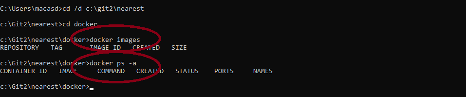
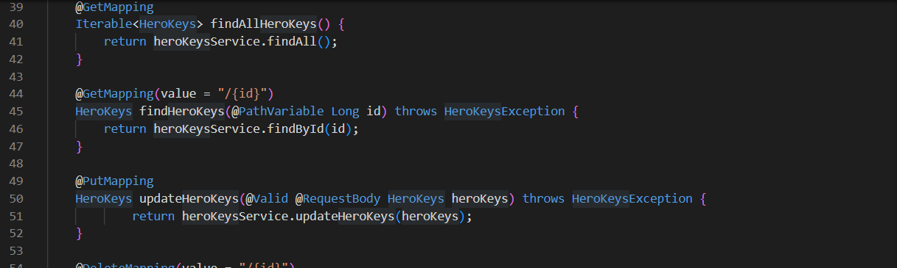
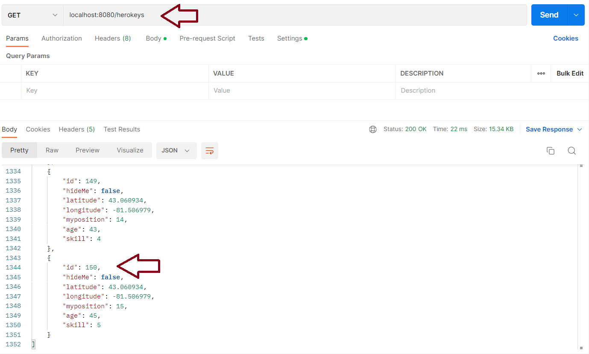
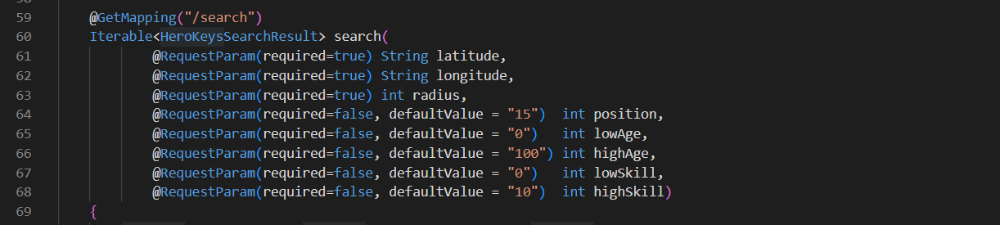
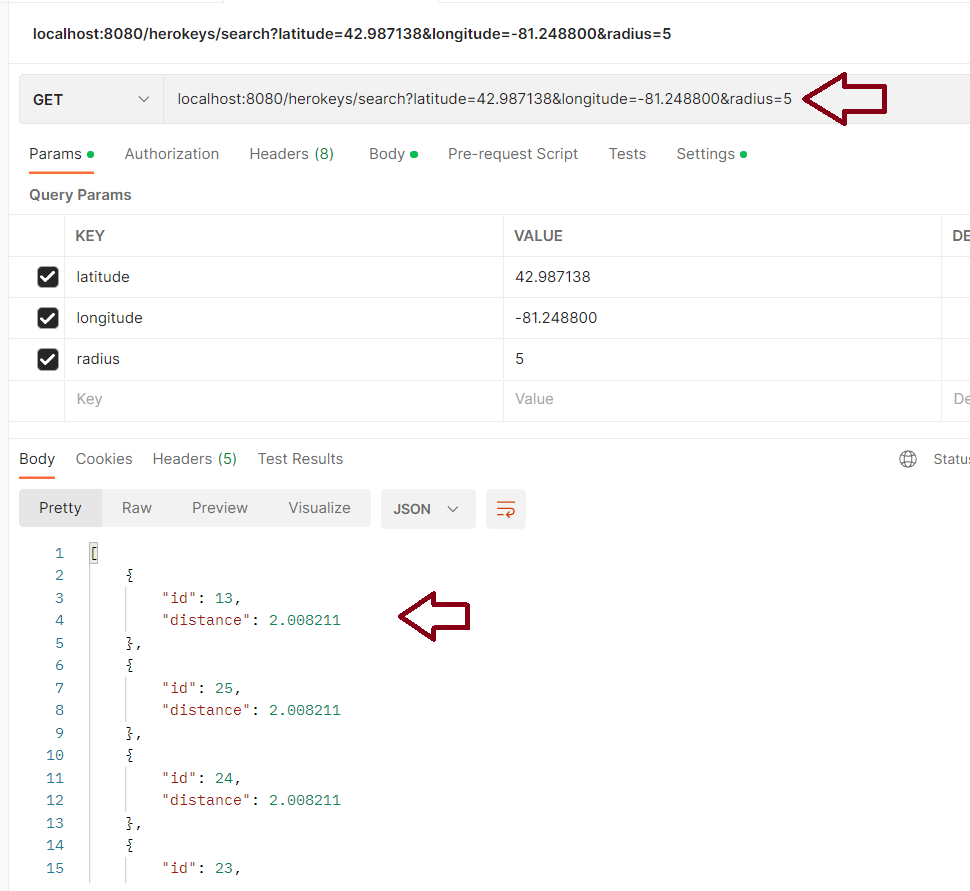

# Testing Nearest  

Its possible to test the Nearest service locally to prove its working.  This also helps prove your environment.  
I'm going to include screen shots from my workstation. For context my Git Repo is here: 

`C:\Git2\nearest`

But yours can be anywhere.  

## Building the Application

In a cmd.exe navigate to the repo folder (e.g. `C:\Git2\nearest`) and run the command: 

`mvn clean install -DskipTests `

You should observe the code builds cleanly. If you navigate to the target subfolder you should see a jar file. 

## Building the Docker Images for the Test  

In a cmd.exe navigate to the docker\mysql subfolder of the repo. If you edit the Dockerfile within you will see the command you need to run in order to build the MySQL docker image. In the cmd.exe run the command: 

`docker build -t mysql:hockeyhero_nearest .`  

You can confirm the image was built by running the docker command `docker images` to list the images.  

In the cmd.exe navigate to the docker\nearest subfolder of the repo. If you edit the Dockerfile within you will see the command you need to run in order to build the Nearest docker image.  Note you need to run this command from the target subfolder of the repo, so in the cmd.exe navigate there and run the command. In my case it was:  

`docker build -f C:\Git2\nearest\docker\nearest\Dockerfile -t app:hockeyhero_nearest .`  

Again you can confirm the image was built by running the docker command `docker images` to list the images. In the picture below you can see Ive run two commands to show I have no images and no containers. 

Finally, in the cmd.exe navigate to the docker subfolder of the repo.  If you edit the docker-compose.yml file within you will see the instructions you need to run in order to launch the system. In the cmd.exe run the command: 

`docker-compose up`

You should see logging indicating both the nearest_mysql and nearest_app docker containers starting. 

## Testing Using Postman

With the docker images running you can test the system using Postman. 

Some background. If you read the `docker\mysql\Dockerfile` at the bottom you will see a command to ensure some start up scripts are run when the MySQL container starts: 

`COPY ./sql-scripts/ /docker-entrypoint-initdb.d/`

This seeds the db with data. There are 150 records added (see `InsertData.sql`) and the search pattern is described in `TestProcedures.sql` - basically by increasing the radius of your search to a set amount, 25 more players are found. For this test set the centre is Victoria Park London ON (42.987138, -81.248800). You might as well use the same. I'm pretty sure there's a repeating pattern in there too - like the same increment of goalies is found, the same increment of refs is found and so on. The point is you can test. 

If you look at the code (HeroKeysController.java) you will see two things: 

1. the request mapping maps to `/herokeys`
2. The methods are annotated (e.g. @PostMapping, @GetMapping)

Based on this you can form queries within Postman. For example : a GET to localhost:8080/herokeys returns all 150 records. 

Back in HeroKeysController.java, there is a second GET method that takes arguments. 

There are several things to note: 

1. To call this method you need to add `search`
2. Three arguments are requried - latitude, longitude and radius. 
3. Other arguments (position, age, skill) are optional. 

When you call this method you get a return set of two values - id and distance from you. 

