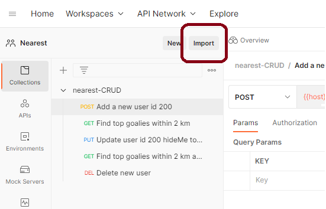
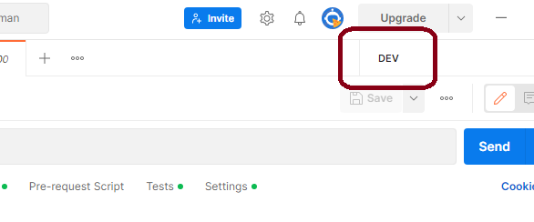
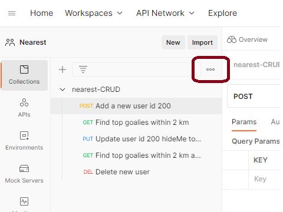
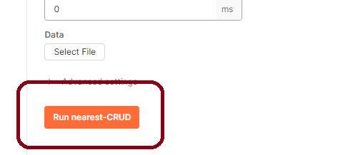

# Testing Using the Postman Desktop Application

With Postman installed and the application running in docker, it should be possible to test the application by: 

- importing postman collection and environmental settings
- setting the environment
- running the collection

## Import Postman Files

In Postman open a new workspace. Use the `Import` command to import all postman files stored in the subfolder \postman. 

With the Collections imported consider taking the time to examine them. For each indvidual step, look at the Params, the Headers, the Pre-Request and the Test scripts - just so you can see what's going on. 

## Setup Environment

The Postman collections are written to use environment variables (e.g. DEV, TEST). You must set the environment in Postman to make these variables available. Once the Postman environment files are imported, select DEV from the environment drop down. 

## Run Collection

With the collections imported and environment set, you should be able to run the collection to test the service. Select the elipse next to the collection name to bring up the context menu; within that menu select `Run Collection`. 

This will bring up a Run Collection panel. You can accept the default settings but for more involved testing you may want to expand the `advanced settings`  and select the option to save the results. 

Press the `Run Collection` button. 

With the docker images running you can test the system using Postman. 

Some background. If you read the `docker\mysql\Dockerfile` at the bottom you will see a command to ensure some start up scripts are run when the MySQL container starts: 

`COPY ./sql-scripts/ /docker-entrypoint-initdb.d/`

This seeds the db with data. There are 150 records added (see `InsertData.sql`) and the search pattern is described in `TestProcedures.sql` - basically by increasing the radius of your search to a set amount, 25 more players are found. For this test set the centre is Victoria Park London ON (42.987138, -81.248800). You might as well use the same. I'm pretty sure there's a repeating pattern in there too - like the same increment of goalies is found, the same increment of refs is found and so on. The point is you can test. 

If you look at the code (HeroKeysController.java) you will see two things: 

1. the request mapping maps to `/herokeys`
2. The methods are annotated (e.g. @PostMapping, @GetMapping)

Based on this you can form queries within Postman. For example : a GET to localhost:8080/herokeys returns all 150 records. 

Back in HeroKeysController.java, there is a second GET method that takes arguments. 

There are several things to note: 

1. To call this method you need to add `search`
2. Three arguments are requried - latitude, longitude and radius. 
3. Other arguments (position, age, skill) are optional. 

When you call this method you get a return set of two values - id and distance from you. 

