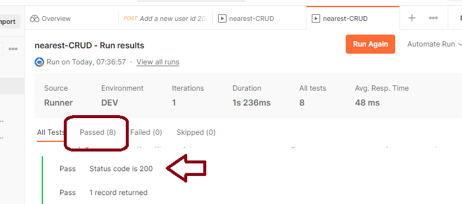

# Testing Using the Postman Desktop Application

With Postman installed and the application running in docker, it should be possible to test the application by: 

- importing postman collection and environmental settings
- setting the environment
- running the collection

## Import Postman Files

In Postman open a new workspace. Use the `Import` command to import all postman files stored in the subfolder \postman. 

With the Collections imported consider taking the time to examine them. For each indvidual step, look at the Params, the Headers, the Pre-Request and the Test scripts - just so you can see what's going on. 

## Setup Environment

The Postman collections are written to use environment variables (e.g. DEV, TEST). You must set the environment in Postman to make these variables available. Once the Postman environment files are imported, select DEV from the environment drop down. 

## Run Collection

With the collections imported and environment set, you should be able to run the collection to test the service. Select the elipse next to the collection name to bring up the context menu; within that menu select `Run Collection`. 

This will bring up a Run Collection panel. You can accept the default settings but for more involved testing you may want to expand the `advanced settings`  and select the option to save the results. 

Press the `Run Collection` button. 

The collection will run. Each step of the collection will run. After each step tests will run to validate the response. On completion the screen should show all tests were successful. 

