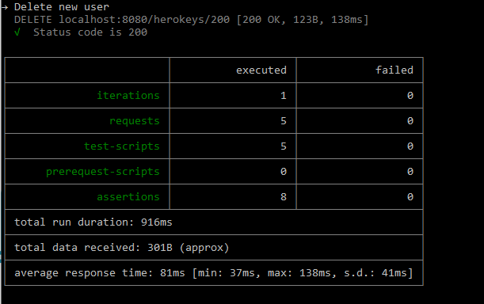

# Testing using Newman CLI

The Postman Desktop Application is an easy way to setup collections and run some ad hoc or smoke tests. However to use postman for repetitive/automated testing you need to use newman. 

To install newman run: 

`npm install -g newman`

Once installed the general command to run newman is: 

`newman run <path to collection> -e <path to environment>`

I accidentally installed newman locally so I had to run 

`node <path to newman> ...`

Either way the result should look like this: 

