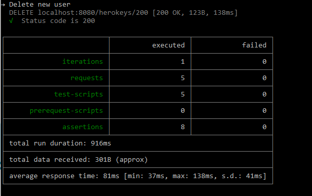

# Testing using Postman CLI

The Postman Desktop Application is an easy way to setup collections and run some ad hoc or smoke tests. However to use postman for repetitive/automated testing you need to use the CLI. 

Instructions for installing the CLI are [here](https://learning.postman.com/docs/postman-cli/postman-cli-installation/).

Once installed the general command to run newman is: 

`postman collection run <path to collection> -e <path to environment>`

The result should look like this: 

