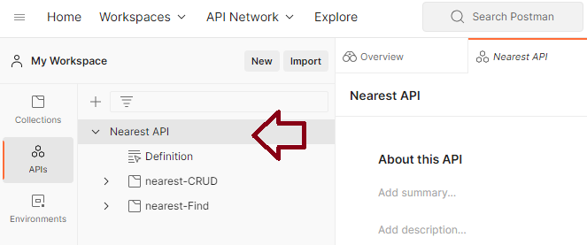
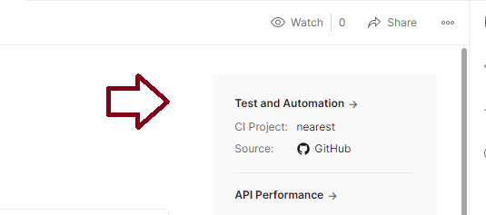
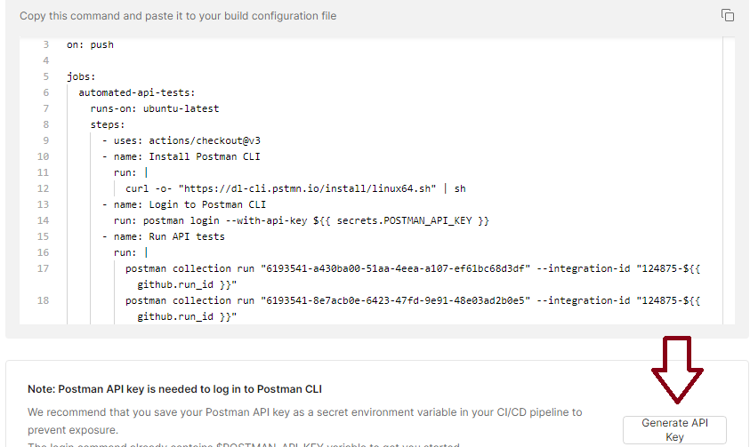

# Automated Testing using Postman

The final step is to integrate Postman into the CI/CD pipeline so testing is automatic. Instructions for doing this are [here](https://learning.postman.com/docs/integrations/available-integrations/ci-integrations/github-actions/).

Postman has a prescribed way of integrating to GitHub Action. First you need to create an API and all all your collections to it. 

When the API is select the right panel changes to display a Test and Automation option. 

If you select that you can integrate Postman with GitHub, your builds, and have Postman generate the flow snippet for you. For example: 

Note there's a lot going on here. The json files are no longer on the command line; they've been replaced with GUIDs. As well there's a POSTMAN secret required to logon to Postman. 

